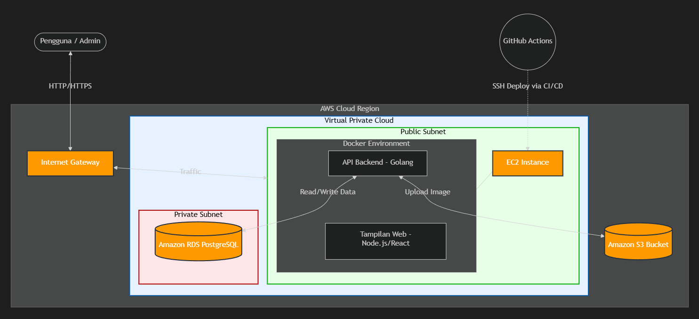

# Trashbin Management System

Sistem manajemen pelaporan dan pembuangan sampah berbasih web. Proyek ini terdiri dari backend menggunakan Go (Golang) dan frontend menggunakan React.js, dengan integrasi layanan AWS (EC2, RDS, dan S3) untuk deployment dan penyimpanan awan.

---

## 📂 Struktur Isi File

Berikut adalah penjelasan struktur direktori dan file pada repositori ini:

```text
trashbin/
├── .github/
│   └── workflows/          # File konfigurasi GitHub Actions untuk CI/CD (deploy.yml, docker-image.yml)
├── backend/                # Direktori sumber (source code) untuk sisi Backend API
│   ├── .env                # (Diabaikan git) Environment variables untuk koneksi DB dan AWS
│   ├── Dockerfile          # Konfigurasi containerized backend Go
│   ├── main.go             # Entry point / routing utama server backend
│   ├── database.go         # Konfigurasi koneksi ke database AWS RDS
│   ├── models.go           # Definisi struktur data (Struct/Model)
│   ├── s3.go               # Konfigurasi dan fungsi utilitas untuk interaksi dengan AWS S3
│   ├── go.mod & go.sum     # Manajemen dependensi Golang
├── frontend/               # Direktori sumber (source code) untuk sisi Web / Frontend
│   ├── public/             # Asset statis yang di-serve secara publik
│   ├── src/                # Kode sumber utama aplikasi React (komponen, halaman, dsb)
│   ├── package.json        # Manajemen dependensi dan script (NPM/Node.js) untuk frontend
│   ├── vite.config.js      # Konfigurasi bundler frontend
│   ├── Dockerfile          # Konfigurasi containerized frontend React/Vite
├── docker-compose.yml      # Konfigurasi layanan Docker multi-container untuk menjalankan frontend dan backend secara bersamaan
└── README.md               # Dokumentasi utama proyek
```

---

## 🚀 Guide Deploy ke Website (via AWS EC2)

Aplikasi ini telah dikonfigurasi untuk berjalan di atas AWS EC2 menggunakan dua metode: (1) manual via Docker Compose dan (2) via CI/CD GitHub Actions. 

### Persyaratan / Prerequisites:
- Server: AWS EC2 Instance (Ubuntu).
- Tooling Server: `docker`, `docker-compose`, `git` ter-install pada server.
- Database: AWS RDS (PostgreSQL/MySQL) yang dapat diakses oleh EC2.
- Storage: AWS S3 Bucket (pastikan IAM Role atau Credentials memiliki askes Put/Get Object ke S3).

### Langkah-langkah Penyiapan Lingkungan:
1. **Clone Repositori di EC2**:
   ```bash
   git clone <url-repository-anda>
   cd trashbin
   ```
2. **Setup File `.env`**:
   Buat atau sesuaikan file konfigurasi environment variable `.env` dengan kredensial dari layanan cloud Anda, khususnya di dalam root direktori dan `backend/`. Contoh:
   ```env
   DB_HOST=my-database.rds.amazonaws.com
   DB_USER=test
   DB_PASSWORD=secret
   DB_NAME=trashbindb
   DB_PORT=5432
   AWS_ACCESS_KEY_ID=your_access_key
   AWS_SECRET_ACCESS_KEY=your_secret_key
   AWS_REGION=ap-southeast-1
   AWS_S3_BUCKET=trashbin-bucket
   ```

### Menjalankan Stack dengan `docker-compose`:
Gunakan perintah di bawah ini untuk men-deploy / mem-build dan menjalankan frontend dan backend sekaligus:

```bash
sudo docker-compose up -d --build
```
- `backend` akan berjalan dan dieskpos melalui port `8080`.
- `frontend` akan berjalan dan diekspos melalui port `80`. 
Akses IP Public EC2 Anda (`http://<ip-public-ec2>`) pada browser. Aplikasi web Anda sudah berjalan dan otomatis terkoneksi ke backend.

### Mekanisme Update / CI-CD:
Berdasarkan file yang berada dalam `.github/workflows/`, setiap *push* ke branch `main` pada GitHub akan memicu workflow aksi GitHub untuk secara otomatis mendeploy versi terbaru aplikasi ke instance EC2 Anda lewat SSH. *Pastikan secret di setelan repositori GitHub (seperti HOST, USERNAME, dan KEY pem ssh) telah terkonfigurasi dengan benar.*

---

## 🏛 Keterangan Diagram Arsitektur

 
*(Catatan: Anda bisa mengganti `./architecture.png` dengan path atau link gambar diagram aslinya dan mengunggah gambar diagram tersebut ke repository untuk diletakkan di dokumentasi agar terlihat seperti foto yang Anda sebutkan).*

Seperti pada foto tersebut, aplikasi ini menganut pemisahan *Client-Server* dan berjalan sepenuhnya di atas ekosistem *Cloud* (AWS). 
Penjelasan Arsitekturnya:

1. **User / Client (Browser)**: 
   Pengguna mengakses aplikasi dari web browser melalui koneksi internet dengan rute ke mesin AWS EC2 (publik melalui Port 80 atau HTTP).

2. **Frontend (Nginx / Vite - React App)**: 
   Berjalan di dalam container Docker. Melakukan serving antarmuka pengguna (UI) kepada pengguna. Semua aksi interaktif oleh pengguna pada antarmuka, seperti melaporkan sampah, akan diteruskan berwujud HTTP Requests untuk Backend.

3. **Backend Service (Golang Apps)**:
   Aplikasi backend yang berjalan di container terpisah. Berperan utama menangani *business logic* mulai dari otentikasi (jika ada), manipulasi dan validasi data, dll. Mengatur jalur komunikasi utama dengan Storage dan Database.

4. **AWS Data Services (RDS & S3)**:
   - **AWS RDS (Relational Database Service)**: Merupakan database terpusat yang menyimpan relasi data secara persistence seperti data pelaporan dan riwayat sampah dalam model tabel. Backend memiliki otoritas untuk Write dan Read ke layanan ini.
   - **AWS S3 (Simple Storage Service)**: Tempat penyimpanan berupa objek. Semua bentuk file media (misal: foto jalanan penuh sampah, bukti pembuangan, atau foto profil pengguna) akan di-upload dan digarap pada bucket ini melalui jembatan API Backend app. S3 digunakan agar load server tidak terbebani file statis yang besar. 